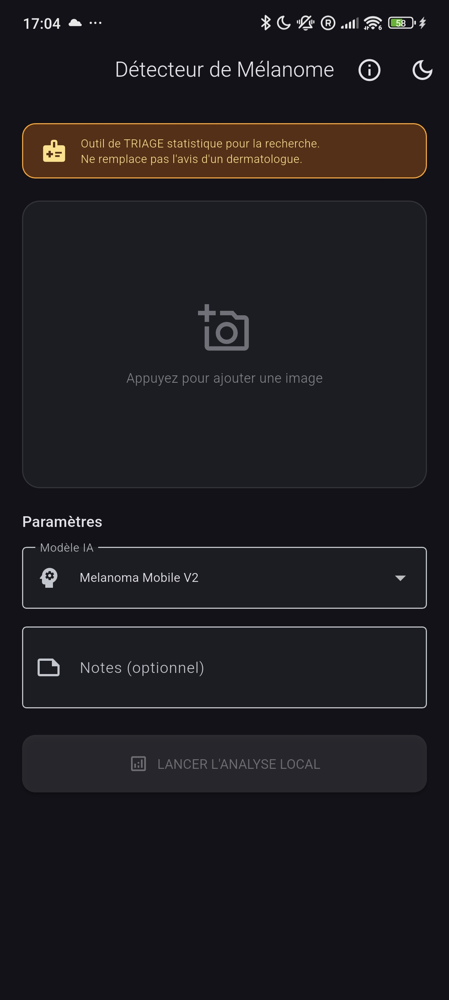
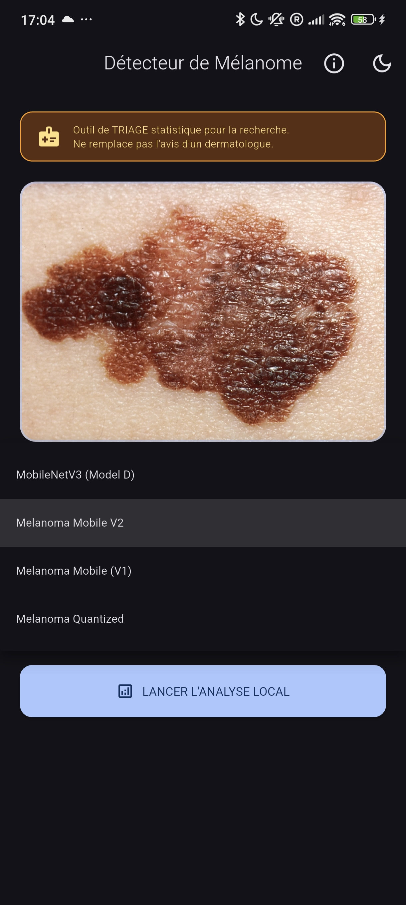
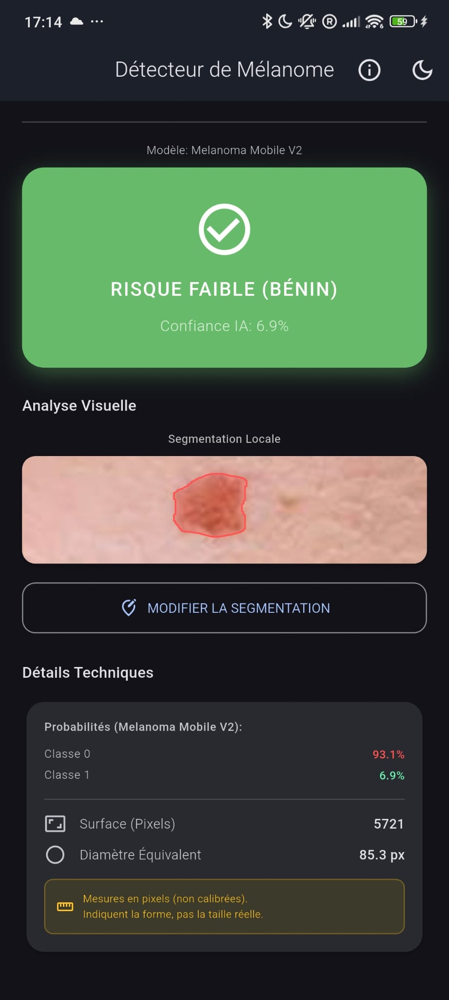
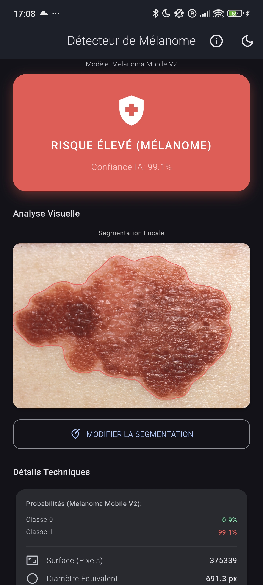
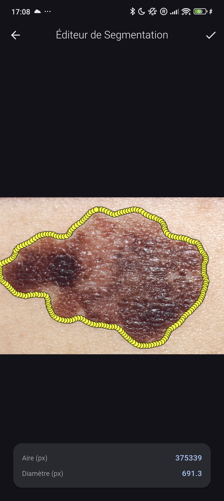

<p align="center">
  <!-- 📸 PLACEHOLDER : Insérer le logo de l'application (ex: assets/images/logo.png) -->
  <h1 align="center">🔬 Détecteur de Mélanome — Local</h1>
  <p align="center">
    <em>Outil de triage dermatologique par intelligence artificielle embarquée</em>
  </p>
</p>

<p align="center">
  
  
  
  
  
  
</p>

---

## 📋 Table des Matières

- [Présentation](#-présentation)
- [Captures d'Écran](#-captures-décran)
- [Architecture](#-architecture---clean-architecture)
- [Stack IA](#-stack-ia)
- [Algorithmes Clés](#-algorithmes-clés)
- [Règle ABCD](#-règle-abcd---évaluation-du-risque)
- [Installation](#-installation)
- [Utilisation](#-utilisation)
- [Confidentialité et Traitement Local](#-confidentialité-et-traitement-local)
- [Performance](#-performance)
- [Limitations et Biais](#-limitations-et-biais)
- [Avertissement Médical](#-avertissement-médical)
- [Licence](#-licence)
- [Auteurs](#-auteurs)

---

## 🎯 Présentation

**Détecteur de Mélanome Local** est une application mobile Flutter de **triage dermatologique** conçue pour la recherche académique. Elle exploite l'inférence **PyTorch Lite embarquée** pour analyser des images de lésions cutanées directement sur l'appareil, **sans aucune connexion internet**.

### Fonctionnalités Principales

| Fonctionnalité | Description |
|---|---|
| 🧠 **Classification IA** | Prédiction Bénin/Maligne via MobileNetV3 (et variantes) |
| ✂️ **Segmentation** | Extraction automatique de la forme de la lésion (U-Net) |
| 📐 **Métriques Géométriques** | Calcul d'aire et diamètre équivalent en temps réel |
| ✏️ **Éditeur de Contours** | Modification interactive avec contrôle du nombre de points (8-200) |
| 📄 **Export PDF** | Rapport 2 pages : résumé + image avec contours superposés |
| 📊 **Export JSON** | Export des données d'analyse au format JSON |
| 🗂️ **Historique** | Sauvegarde locale des analyses avec Hive (persistance hors-ligne) |
| 🎨 **Thème Dynamique** | Material 3 avec modes clair/sombre/système |
| 🔒 **100% Hors-Ligne** | Aucune donnée ne quitte l'appareil |

---

## 📸 Captures d'Écran

| Écran d'accueil | Sélection d'image | Résultat (Faible) |
|:---:|:---:|:---:|
|  |  |  |

| Résultat (Élevé) | Éditeur de contours |
|:---:|:---:|
|  |  |

---

## 🏗 Architecture — Clean Architecture

L'application suit une **Clean Architecture stricte** en trois couches indépendantes, garantissant testabilité, maintenabilité et séparation des responsabilités.

<!-- 📸 PLACEHOLDER : Insérer le diagramme d'architecture (docs/architecture_diagram.png) -->

```
lib/
├── domaine/                     # 🟢 Couche Domaine (Pure Dart)
│   ├── entites/
│   │   ├── definition_modele.dart        # Configuration d'un modèle IA
│   │   ├── entite_analyse_sauvegardee.dart # Entité de persistance
│   │   ├── niveau_risque.dart            # Enum de risque + données associées
│   │   └── resultat_analyse.dart         # DTO du résultat d'analyse
│   ├── depots/
│   │   └── depot_analyse.dart            # Interface abstraite du dépôt
│   ├── cas_utilisation/
│   │   ├── exporter_pdf.dart             # Cas d'utilisation export PDF
│   │   ├── exporter_json.dart            # Cas d'utilisation export JSON
│   │   ├── sauvegarder_analyse.dart      # Cas d'utilisation sauvegarde
│   │   └── obtenir_historique.dart       # Cas d'utilisation historique
│   └── services/
│       └── service_geometrie.dart        # Calculs géométriques (Shoelace)
│
├── donnees/                     # 🔵 Couche Données
│   ├── config/
│   │   └── config_modeles.dart           # Registre centralisé des modèles
│   ├── depots/
│   │   └── depot_analyse_hive.dart       # Implémentation Hive du dépôt
│   ├── modeles/
│   │   ├── modele_analyse_hive.dart      # Modèle Hive (TypeAdapter)
│   │   └── modele_analyse_hive.g.dart    # Code généré Hive
│   └── services/
│       ├── service_pytorch.dart          # Inférence PyTorch Lite + Moore-Neighbor
│       ├── service_export_pdf.dart       # Génération PDF (2 pages + contours)
│       └── service_export_json.dart      # Génération JSON
│
├── presentation/                # 🟣 Couche Présentation (Flutter)
│   ├── providers/
│   │   └── provider_melanome.dart        # État réactif (ChangeNotifier)
│   ├── pages/
│   │   ├── page_accueil.dart             # Page principale
│   │   ├── page_resultats.dart           # Affichage des résultats
│   │   ├── page_editeur_contours.dart    # Éditeur interactif de contours
│   │   └── page_historique.dart          # Historique des analyses
│   ├── widgets/
│   │   ├── carte_risque.dart
│   │   ├── carte_details_techniques.dart
│   │   ├── formulaire_analyse.dart
│   │   ├── carte_selection_image.dart
│   │   ├── banniere_avertissement.dart
│   │   ├── peintre_segmentation.dart
│   │   └── squelette_resultats.dart      # Skeleton loading pendant l'analyse
│   └── theme/
│       └── couleurs_risque.dart           # Mapping Risque → Couleur/Icône
│
├── theme/
│   └── app_theme.dart            # Thème Material 3 (clair + sombre)
├── services/
│   └── theme_service.dart        # Persistance du choix de thème
└── main.dart                     # Point d'entrée + init Hive
```

### Principes Architecturaux

| Principe | Implémentation |
|---|---|
| **Séparation des couches** | Domaine pur Dart (aucun import Flutter), Données isolées, Présentation réactive |
| **Inversion de dépendances** | La couche Domaine ne dépend de rien ; les couches externes dépendent d'elle |
| **Cas d'utilisation** | Chaque action métier est un cas d'utilisation isolé (Export PDF, Sauvegarde, etc.) |
| **Repository Pattern** | Interface abstraite `DepotAnalyse` + implémentation `DepotAnalyseHive` |
| **État réactif** | `ProviderMelanome` étend `ChangeNotifier` — UI 100% déclarative |
| **Singleton contrôlé** | `ServicePyTorch` en singleton pour éviter le rechargement des modèles |
| **Nomenclature française** | Variables, classes et commentaires en français pour clarté académique |

### Flux de Données

```
┌─────────────┐     ┌──────────────────┐     ┌──────────────────┐
│   UI/Page   │────▶│ ProviderMelanome │────▶│  ServicePyTorch  │
│  (Flutter)  │◀────│  (État Réactif)  │◀────│  (Inférence IA)  │
└─────────────┘     └──────────────────┘     └──────────────────┘
                           │                         │
                           ▼                         ▼
                    ┌──────────────┐          ┌──────────────┐
                    │ ServiceGéo.  │          │ ConfigModèles│
                    │ (Domaine)    │          │ (Données)    │
                    └──────────────┘          └──────────────┘
```

---

## 🧠 Stack IA

### Classification — MobileNetV3

| Paramètre | Valeur |
|---|---|
| **Architecture** | MobileNetV3-Large (Transfer Learning) |
| **Entrée** | 224×224 px (Model D) / 384×384 px (V1, V2, Quantized) |
| **Sortie** | 2 classes (Bénin, Maligne) |
| **Entraînement** | ~25 000 images (ISIC 2019) avec perte pondérée |
| **Performance** | AUC 0.9053 · Accuracy 89.0% · Sensibilité 64.7% · Spécificité 93.7% |
| **Quantisation** | Variante Int8 disponible pour rapidité sur mobile |
| **Format** | PyTorch Lite (`.ptl`) — exécution 100% embarquée |

### Modèles Disponibles

| Modèle | Fichier Asset | Entrée | Notes |
|---|---|---|---|
| MobileNetV3 (Model D) | `melanoma_mobilenet_v3.ptl` | 224×224 | Principal, plus rapide |
| Melanoma Mobile V2 | `melanoma_mobile_v2.ptl` | 384×384 | Par défaut, meilleure précision |
| Melanoma Mobile (V1) | `melanoma_mobile.ptl` | 384×384 | Version initiale |
| Melanoma Quantized | `melanoma_mobile_quantized.ptl` | 384×384 | Int8, optimisé taille/vitesse |

### Segmentation — U-Net

| Paramètre | Valeur |
|---|---|
| **Architecture** | U-Net avec encodeur EfficientNet-B3 |
| **Entrée** | 256×256 px |
| **Entraînement** | HAM10000 (~10 000 masques experts) |
| **Performance** | Dice 0.93 · IoU 0.88 |
| **Sortie** | Masque binaire → contours via Moore-Neighbor |

### Normalisation ImageNet

Tous les modèles utilisent la normalisation standard ImageNet :

```
Moyenne (RGB) : [0.485, 0.456, 0.406]
Écart-type    : [0.229, 0.224, 0.225]
```

---

## ⚙️ Algorithmes Clés

### Moore-Neighbor — Extraction de Contours

L'algorithme de **Moore-Neighbor** extrait le contour d'un masque binaire de segmentation. Notre implémentation inclut des optimisations significatives par rapport à l'approche classique.

#### Principe

1. **Balayage** du masque pour trouver le premier pixel de premier plan.
2. **Traçage** du contour en suivant les 8-voisins dans le sens horaire.
3. **Arrêt** lorsque le point de départ est revisité (contour fermé).
4. **Simplification** à ~300 points pour le rendu temps réel.

#### Optimisation — Table de Lookup O(1)

L'implémentation classique utilise 8 conditions `if-else` pour déterminer la direction. Notre version utilise un **encodage arithmétique** pour un accès O(1) :

```dart
/// Table de lookup : (dX + 1) * 3 + (dY + 1) → direction [0..7]
static int _obtenirDirection(int dX, int dY) {
  const table = [7, 6, 5, 0, -1, 4, 1, 2, 3];
  final index = (dX + 1) * 3 + (dY + 1);
  return table[index];
}
```

| Approche | Complexité | Branchements |
|---|---|---|
| Classique (if-else) | O(n) pire cas | 8 conditions séquentielles |
| **Notre implémentation** | **O(1)** | **0 branchement** (accès direct) |

#### Décalages des 8 Voisins

```
     7(-1,-1)  0(0,-1)  1(1,-1)
     6(-1, 0)  [pixel]  2(1, 0)
     5(-1, 1)  4(0, 1)  3(1, 1)
```

```dart
static const _ox = [ 0,  1,  1,  1,  0, -1, -1, -1];
static const _oy = [-1, -1,  0,  1,  1,  1,  0, -1];
```

### Formule du Lacet (Shoelace) — Calcul d'Aire

L'aire d'un polygone défini par ses contours est calculée via la [formule du lacet](https://fr.wikipedia.org/wiki/Formule_du_lacet) :

```
A = ½ |Σᵢ (xᵢ·yᵢ₊₁ − xᵢ₊₁·yᵢ)|
```

Le **diamètre équivalent** est ensuite déduit comme le diamètre d'un cercle de même aire :

```
d = 2√(A/π)
```

---

## 🔴 Règle ABCD — Évaluation du Risque

L'application évalue le risque de malignité via un système à trois niveaux basé sur la probabilité de sortie du modèle.

### Mapping Risque ↔ Couleur

| Niveau de Risque | Probabilité | Couleur | Icône | Libellé |
|---|---|---|---|---|
| 🟢 **Faible** | < 30% | `riskLow` (Vert) | ✅ `check_circle_outline` | *Risque Faible (Bénin)* |
| 🟡 **Modéré** | 30% – 60% | `riskModerate` (Ambre) | ⚠️ `warning_amber_rounded` | *Risque Modéré (Suspect)* |
| 🔴 **Élevé** | > 60% | `riskHigh` (Rouge) | 🏥 `health_and_safety` | *Risque Élevé (Mélanome)* |

### Séparation Domaine / Présentation

La logique de risque est **strictement découplée** de l'interface :

```dart
// 🟢 DOMAINE (Pure Dart — aucun import Flutter)
static DonneesRisque evaluerNiveauRisque(double probabilite) {
  if (probabilite < 0.30) return DonneesRisque(niveau: NiveauRisque.faible, ...);
  if (probabilite < 0.60) return DonneesRisque(niveau: NiveauRisque.modere, ...);
  return DonneesRisque(niveau: NiveauRisque.eleve, ...);
}

// 🟣 PRÉSENTATION (Flutter — mapping visuel)
static Color couleur(NiveauRisque niveau, Brightness brightness) {
  switch (niveau) {
    case NiveauRisque.faible: return AppTheme.riskLow(brightness);
    case NiveauRisque.modere: return AppTheme.riskModerate(brightness);
    case NiveauRisque.eleve:  return AppTheme.riskHigh(brightness);
  }
}
```

---

## 🚀 Installation

### Prérequis

| Outil | Version Minimale | Vérification |
|---|---|---|
| Flutter SDK | 3.7.0+ | `flutter --version` |
| Dart SDK | 3.7.0+ | `dart --version` |
| Android Studio | 2024.x+ | Avec SDK Android 34+ |
| Java (JDK) | 17+ | `java -version` |

### Étapes

```bash
# 1. Cloner le dépôt
git clone <url-du-dépôt>
cd melanoma_detector_ptl

# 2. Installer les dépendances
flutter pub get

# 3. Vérifier l'environnement
flutter doctor

# 4. Connecter un appareil Android (ou lancer un émulateur)
flutter devices

# 5. Lancer en mode debug
flutter run
```

### Construction Release (APK)

```bash
# APK optimisé pour distribution
flutter build apk --release

# L'APK sera généré dans : build/app/outputs/flutter-apk/app-release.apk
```

### Notes Importantes

> **⚠️ Taille de l'application :** Les modèles PyTorch Lite (~60 Mo au total) sont inclus dans les assets. L'APK final pèse environ **80–100 Mo**.

> **📦 Package local :** Le package `pytorch_lite` est référencé localement via `path: ./packages/pytorch_lite`. Assurez-vous que ce répertoire est inclus dans le clone.

---

## 📖 Utilisation

### Flux d'Analyse

```
1. Sélectionner une image (📷 Caméra ou 🖼 Galerie)
        │
        ▼
2. Choisir le modèle IA (dropdown) + ajouter des notes
        │
        ▼
3. Lancer l'analyse (bouton) → Skeleton loading animé
        │
        ├──▶ Classification (MobileNetV3) → Bénin/Maligne + Confiance
        │
        └──▶ Segmentation (U-Net) → Masque → Contours (Moore-Neighbor)
                │
                ▼
4. Résultats affichés :
   • Carte de risque colorée (Faible/Modéré/Élevé)
   • Contours superposés sur l'image
   • Métriques : aire (px²), diamètre (px)
   • Probabilités par classe
        │
        ▼
5. Actions post-analyse :
   • ✏️ Modifier les contours (slider 8-200 points)
   • 📄 Exporter en PDF (rapport 2 pages + contours)
   • 📊 Exporter en JSON
   • 💾 Sauvegarder dans l'historique local (Hive)
        │
        ▼
6. Historique :
   • 🗂️ Consulter les analyses sauvegardées
   • 🔄 Recharger et ré-exporter une analyse passée
```

---

## 🔒 Confidentialité et Traitement Local

<table>
<tr><th>Aspect</th><th>Garantie</th></tr>
<tr><td>📡 Connexion réseau</td><td><strong>Aucune</strong> — l'application fonctionne 100% hors-ligne</td></tr>
<tr><td>📤 Envoi de données</td><td><strong>Zéro</strong> — aucune image ne quitte l'appareil</td></tr>
<tr><td>📊 Télémétrie</td><td><strong>Désactivée</strong> — aucun analytics, crash reporting, ou logging externe</td></tr>
<tr><td>🗄️ Stockage</td><td><strong>Éphémère</strong> — les images ne sont pas sauvegardées par l'application</td></tr>
<tr><td>🧠 Inférence</td><td><strong>Embarquée</strong> — PyTorch Lite s'exécute directement sur le processeur/GPU mobile</td></tr>
</table>

### Dépendances Réseau — Aucune

Le fichier `pubspec.yaml` inclut le package `http` comme dépendance legacy, mais **aucun appel réseau n'est effectué** dans le code de l'application refactorisée. Toute la logique d'API (Gradio, Hugging Face) a été supprimée lors de la migration vers l'architecture locale.

---

## 📊 Performance

### Métriques du Modèle Principal (MobileNetV3 — ISIC 2019)

| Métrique | Valeur |
|---|---|
| AUC (ROC) | **0.9053** |
| Accuracy | **89.0%** |
| Sensibilité (Recall) | **64.7%** |
| Spécificité | **93.7%** |

### Optimisations d'Inférence

| Optimisation | Avant | Après |
|---|---|---|
| Appels modèle par image | 2 (probs + label) | **1** (label déduit des probs) |
| Lecture des octets image | 2× (classification + dimensions) | **1×** (lecture unique) |
| Moore-Neighbor (direction) | 8 if-else O(n) | **Table lookup O(1)** |
| Fuite mémoire codec image | ❌ Non disposé | ✅ `frame.image.dispose()` |

---

## ⚠️ Limitations et Biais

| Limitation | Détail |
|---|---|
| **Biais de données** | Entraîné majoritairement sur peaux claires (Fitzpatrick Types I–III). Performances potentiellement réduites sur peaux foncées. |
| **Pilosité** | La pilosité dense peut affecter la segmentation et la classification. |
| **Éclairage** | Sensible aux ombres, éclairage jaune, et reflets sur la peau. |
| **Mesures** | Les dimensions sont en **pixels relatifs** (non calibrées en mm). Elles indiquent la forme, pas la taille réelle. |
| **Sensibilité** | 64.7% — signifie que environ 35% des mélanomes réels peuvent ne pas être détectés. |

---

## 🏥 Avertissement Médical

> **⚠️ AVERTISSEMENT IMPORTANT**
>
> Cette application est un **outil de TRIAGE STATISTIQUE** conçu exclusivement pour la **recherche académique**. Elle n'est en aucun cas un dispositif médical certifié et **ne remplace pas l'avis d'un dermatologue qualifié**.
>
> - ❌ **Ne constitue PAS un diagnostic médical.**
> - ❌ **Ne doit PAS être utilisée comme seule base de décision clinique.**
> - ✅ Conçue comme **aide au triage** pour orienter vers une consultation spécialisée.
> - ✅ Les résultats doivent être **interprétés par un professionnel de santé**.
>
> Les auteurs déclinent toute responsabilité quant aux décisions médicales prises sur la base des résultats de cette application. En cas de doute sur une lésion cutanée, **consultez immédiatement un dermatologue**.

---

## 📄 Licence

Ce projet est développé dans un cadre **académique et de recherche** (Projet Tuteuré — IUT Informatique).

Tous droits réservés. L'utilisation, la modification et la distribution sont soumises aux conditions définies par l'établissement d'enseignement.

---

## 👥 Auteurs

| Rôle | Contributeur |
|---|---|
| **Développement & Architecture** | Martinez, Rosenkranz, Terrier |
| **Projet Tuteuré** | IUT Informatique — 3ème année, Semestre 1 |

---

<p align="center">
  <sub>Développé avec Flutter · 100% local · Zéro données envoyées</sub>
</p>
